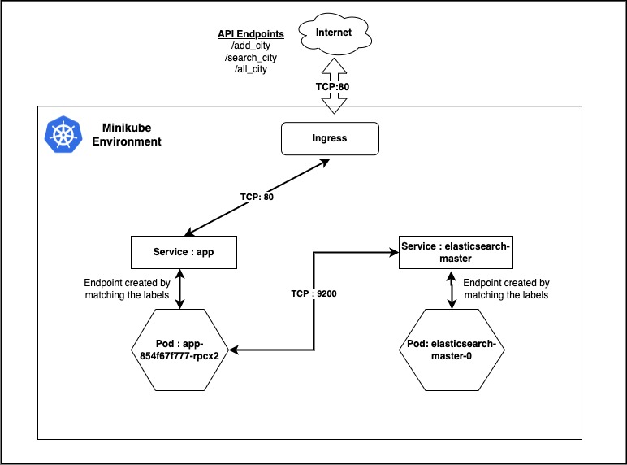

# City Population Tracker

## Architecture Diagram:



This Python Flask application is keep track of list of cities and their population. The backend database is used in this demo application is Elasticsearch. Since this is demo, The storage is not persisted.

**API Endpoints:**

*  **/add_city** : This API endpoint is accept a POST request along with data ('id' 'cityname' 'population') and data will be insert into Elasticsearch's population indice

*  **/search_city** : This API endpoint is accept a POST request along with data ('cityname') and query the Elasticsearch and return the data

*  **/all_city** : This API endpoint is accept a GET request return all the data from Elasticsearch indice population

*  **/health** : This API used to check wheather the application is up or not by returing mesaage : OK and it is checked by kubernetes readiness and livenesss probes.


**INSTALLATION:**

Prerequisite

1.Install Minikube and Helm
- Minikube Installed on the system (Tested on : v1.23.2). Make sure sufficient memory is available (minikube start --driver=virtualbox --memory 4000)
- Helm Client Installed on the system (Tested on : v3.7.1).

Minikube : https://minikube.sigs.k8s.io/docs/start/
Helm : https://helm.sh/docs/intro/install/

2. Run the script start.sh
```bash
sh start.sh
```

This solution tested successfully on Minikube with MacOS
```bash
minikube version: v1.23.2
```

The **start.sh** script will do the docker image build and helm installation

**OUTPUT**

```bash

temp-raisal/flask-app - (main) >sh start.sh
[INFO]: Logged into the minikube docker environment
Sending build context to Docker daemon  326.7kB
Step 1/7 : FROM python:3.8-alpine
3.8-alpine: Pulling from library/python
2408cc74d12b: Pull complete
2f22aa6a21a6: Pull complete
b7017d904e36: Pull complete
0b104bf00a69: Pull complete
00abd2ad2194: Pull complete
Digest: sha256:0e335d4425f6b3e1cb7d66fbe185ff43c390ee75b5cfc4c18ca211cd03473325
Status: Downloaded newer image for python:3.8-alpine
 ---> 926e859df334
Step 2/7 : COPY ./requirements.txt /app/requirements.txt
 ---> e115582227d5
Step 3/7 : WORKDIR /app
 ---> Running in f502c2772448
Removing intermediate container f502c2772448
 ---> 3740fa54c76f
Step 4/7 : RUN pip install -r requirements.txt
 ---> Running in 8fd6044f9416
Collecting Flask==2.0.2
  Downloading Flask-2.0.2-py3-none-any.whl (95 kB)
     ━━━━━━━━━━━━━━━━━━━━━━━━━━━━━━━━━━━━━━━━ 95.2/95.2 KB 2.3 MB/s eta 0:00:00
Collecting elasticsearch==7.0
  Downloading elasticsearch-7.0.0-py2.py3-none-any.whl (80 kB)
     ━━━━━━━━━━━━━━━━━━━━━━━━━━━━━━━━━━━━━━━━ 80.5/80.5 KB 9.3 MB/s eta 0:00:00
Collecting requests
  Downloading requests-2.28.1-py3-none-any.whl (62 kB)
     ━━━━━━━━━━━━━━━━━━━━━━━━━━━━━━━━━━━━━━━━ 62.8/62.8 KB 18.9 MB/s eta 0:00:00
Collecting Werkzeug>=2.0
  Downloading Werkzeug-2.1.2-py3-none-any.whl (224 kB)
     ━━━━━━━━━━━━━━━━━━━━━━━━━━━━━━━━━━━━━━━ 224.9/224.9 KB 6.5 MB/s eta 0:00:00
Collecting itsdangerous>=2.0
  Downloading itsdangerous-2.1.2-py3-none-any.whl (15 kB)
Collecting click>=7.1.2
  Downloading click-8.1.3-py3-none-any.whl (96 kB)
     ━━━━━━━━━━━━━━━━━━━━━━━━━━━━━━━━━━━━━━━━ 96.6/96.6 KB 21.7 MB/s eta 0:00:00
Collecting Jinja2>=3.0
  Downloading Jinja2-3.1.2-py3-none-any.whl (133 kB)
     ━━━━━━━━━━━━━━━━━━━━━━━━━━━━━━━━━━━━━━ 133.1/133.1 KB 17.7 MB/s eta 0:00:00
Collecting urllib3>=1.21.1
  Downloading urllib3-1.26.10-py2.py3-none-any.whl (139 kB)
     ━━━━━━━━━━━━━━━━━━━━━━━━━━━━━━━━━━━━━━ 139.2/139.2 KB 19.6 MB/s eta 0:00:00
Collecting charset-normalizer<3,>=2
  Downloading charset_normalizer-2.1.0-py3-none-any.whl (39 kB)
Collecting idna<4,>=2.5
  Downloading idna-3.3-py3-none-any.whl (61 kB)
     ━━━━━━━━━━━━━━━━━━━━━━━━━━━━━━━━━━━━━━━━ 61.2/61.2 KB 17.4 MB/s eta 0:00:00
Collecting certifi>=2017.4.17
  Downloading certifi-2022.6.15-py3-none-any.whl (160 kB)
     ━━━━━━━━━━━━━━━━━━━━━━━━━━━━━━━━━━━━━━ 160.2/160.2 KB 15.3 MB/s eta 0:00:00
Collecting MarkupSafe>=2.0
  Downloading MarkupSafe-2.1.1-cp38-cp38-musllinux_1_1_x86_64.whl (29 kB)
Installing collected packages: Werkzeug, urllib3, MarkupSafe, itsdangerous, idna, click, charset-normalizer, certifi, requests, Jinja2, elasticsearch, Flask
Successfully installed Flask-2.0.2 Jinja2-3.1.2 MarkupSafe-2.1.1 Werkzeug-2.1.2 certifi-2022.6.15 charset-normalizer-2.1.0 click-8.1.3 elasticsearch-7.0.0 idna-3.3 itsdangerous-2.1.2 requests-2.28.1 urllib3-1.26.10
WARNING: Running pip as the 'root' user can result in broken permissions and conflicting behaviour with the system package manager. It is recommended to use a virtual environment instead: https://pip.pypa.io/warnings/venv
WARNING: You are using pip version 22.0.4; however, version 22.1.2 is available.
You should consider upgrading via the '/usr/local/bin/python -m pip install --upgrade pip' command.
Removing intermediate container 8fd6044f9416
 ---> 627db2d03965
Step 5/7 : COPY . /app
 ---> 5d50096b1548
Step 6/7 : ENTRYPOINT [ "python" ]
 ---> Running in edd82065241d
Removing intermediate container edd82065241d
 ---> 30a417830c2e
Step 7/7 : CMD ["main.py" ]
 ---> Running in 980e8a806437
Removing intermediate container 980e8a806437
 ---> e5e0844187b3
Successfully built e5e0844187b3
Successfully tagged flask-app:local
[Success]: Image successfully builded
[INFO]: Adding helm elastic repository at local
WARNING: Kubernetes configuration file is group-readable. This is insecure. Location: /Users/raisal/.kube/config
"elastic" has been added to your repositories
WARNING: Kubernetes configuration file is group-readable. This is insecure. Location: /Users/raisal/.kube/config
NAME: elasticsearch
LAST DEPLOYED: Fri Jul  8 17:01:00 2022
NAMESPACE: default
STATUS: deployed
REVISION: 1
NOTES:
1. Watch all cluster members come up.
  $ kubectl get pods --namespace=default -l app=elasticsearch-master -w2. Test cluster health using Helm test.
  $ helm --namespace=default test elasticsearch

[Success]: Elasticsearch Deployed
[INFO]: Enabling Addon Ingress for Minikube
    ▪ Using image k8s.gcr.io/ingress-nginx/controller:v1.0.0-beta.3
    ▪ Using image k8s.gcr.io/ingress-nginx/kube-webhook-certgen:v1.0
    ▪ Using image k8s.gcr.io/ingress-nginx/kube-webhook-certgen:v1.0
🔎  Verifying ingress addon...
🌟  The 'ingress' addon is enabled
[INFO]: Starting the Application using Helm
WARNING: Kubernetes configuration file is group-readable. This is insecure. Location: /Users/raisal/.kube/config
NAME: app
LAST DEPLOYED: Fri Jul  8 17:01:05 2022
NAMESPACE: default
STATUS: deployed
REVISION: 1
TEST SUITE: None
NOTES:
Deployed

[Success]: App Deployed


NAME                     READY   STATUS              RESTARTS   AGE
app-854f67f777-djtsg     0/1     ContainerCreating   0          2s
elasticsearch-master-0   0/1     Running             0          6s

Minikube IP = 192.168.99.100

[INFO] Run following command to insert the first data into Elasticsearch once both the service Ready (This may take ~ 1 Minute)

********************************************************************************************
curl -X POST -F 'id=1' -F 'cityname=newyork' -F 'population=1000043' 192.168.99.100/add_city
********************************************************************************************


[INFO]: Browse http://192.168.99.100/all_city after added the first data


```
```diff
- The Minikube IP may be different in other systems
```


- Once the pods are Ready add the first data to initialize Elasticsearch indice

```bash

>  curl -X POST -F 'id=1' -F 'cityname=newyork' -F 'population=1000043' 192.168.99.100/add_city

{
  "_id": "1",
  "_index": "population",
  "_primary_term": 1,
  "_seq_no": 0,
  "_shards": {
    "failed": 0,
    "successful": 1,
    "total": 2
  },
  "_type": "_doc",
  "_version": 1,
  "result": "created"
}

Add few more data

>   curl -X POST -F 'id=2' -F 'cityname=dubai' -F 'population=50004583' 192.168.99.100/add_city

{
  "_id": "2",
  "_index": "population",
  "_primary_term": 1,
  "_seq_no": 1,
  "_shards": {
    "failed": 0,
    "successful": 1,
    "total": 2
  },
  "_type": "_doc",
  "_version": 1,
  "result": "created"
}

```


- Browse http://192.168.99.100/all_city on the webbrowser to view the details of all cities inserted


- Search the city details with the following command

```bash

> curl -X POST -F 'cityname=dubai'  192.168.99.100/search_city

[
  {
    "_id": "2",
    "_index": "population",
    "_score": 0.6931471,
    "_source": {
      "city_name": "dubai",
      "id": "2",
      "population": "50004583"
    },
    "_type": "_doc"
  }
]

```

Once the testing is completed or failed in between remove the resources using following commmands.

```bash
helm uninstall app elasticsearch
```